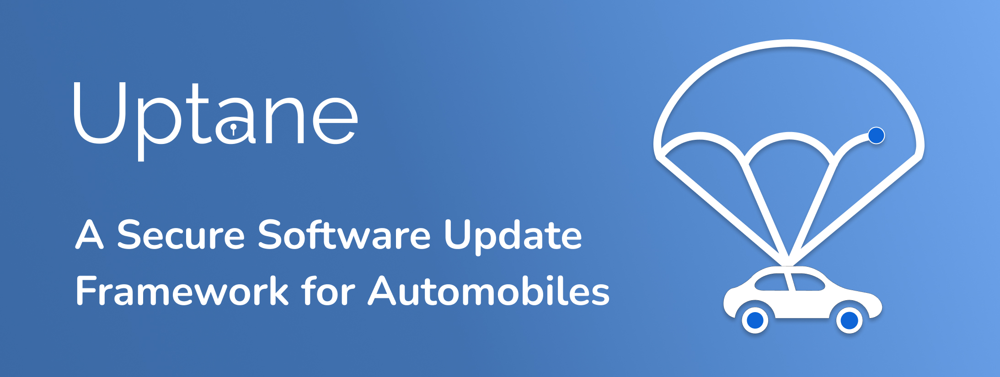

## Welcome to Uptane community 👋

  

      <picture align="center">
         
      </picture>

## About us

Uptane is the first software update security system for the automotive industry capable of resisting even attacks by nation-state level actors. It is designed so that the security of software updates does not degrade all at once, but depends on a hierarchy in which different levels of access privilege to vehicles and/or the automaker’s infrastructure must be gained before serious damage can be inflicted. By building these access control levels into the security system, even if an attacker compromises servers, bribes operators, or gains access to vehicular networks, he or she is prevented from causing many types of harm to the vehicle.
Though initially designed for the automotive industry, Uptane is now being applied to a host of other industries that rely on software-over-the-air technology to deliver secure updates. Since its inception Uptane has been applied to many fields, including ndustrial robotics, medicine, and smart infrastructure.

Here is an overview of the Uptane project and the numerous repositories linked to this page that offer ways to interact and contribute.

One significant distinction between Uptane and other secure software update approaches is that our community is built around a standard rather than a specific implementation of a technology. If followed as specified, the [Uptane Standard for Design and Implementation](https://uptane.org/docs/latest/standard/uptane-standard), can reduce the potential for attackers to compromise critical systems and ensures a faster and easier recovery process after a compromise occurs. Coupled with a set of [Deployment Best Practices](https://uptane.org/docs/latest/deployment/best-practices), which provides recommendations for adapting the Uptane Standard to specific needs of legacy systems and differing applications, Uptane can deliver unprecedented flexibility of deployment, without any compromise on security.

Both the Standard and the Deployment Best Practices are living documents, which are regularly updated based on direct input from community members, and industry trends raised in Uptane sponsored workshops and whitepapers.

## Affiliations/Adoptions

Uptane is a Linux Foundation Joint Development Foundation project.

The Uptane framework is incorporated in [Automotive Grade Linux](https://www.automotivelinux.org/), which is supported by [major OEMs and suppliers](https://www.automotivelinux.org/about/members/). Uptane's presence in AGL is implemented in via [aktualizr](https://github.com/uptane/aktualizr), which is also integrated into the [OTA Community Edition](https://github.com/uptane/ota-community-edition/) and [GENIVI](https://covesa.global/).

For more information on Uptane adoptions, go to https://uptane.org/learn-more/adoptions.

## Get involved

The Uptane project offers a number of ways for community members to participate in the advancement of secure software updates. These include submitting issues for the Standard or Deployment Pages, attending the biweekly Standards meetings or the specialized community forums held both in person and online, or sharing case histories of implementations in either print or video formats.

Issues related to the Standard or Deployment Best Practices can be posted directly to the repositories.

---

## Connect With Us

